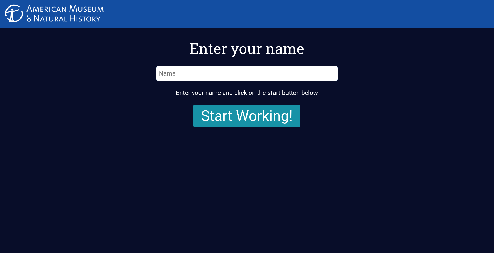

# amnh-validation-tool

This is a tool based on the prototype we built at the AMNH Hack the Deep Hackaton 2018.

It is a simple web application that helps AMNH Marine Samples volunteers to input and generate CSV records of
the marine samples collected by the museum.

It's goal is to help lower the number of input errors while recording each specimen.
Most of the WebApp functionalities work offline, but some of them require internet access to work.
It does not require a backend and can be hosted on a free service such as github pages.

## Features

* Validates Taxonomical data using the Worms API
* Validates long and lat locations by using the Gmaps API
* Validates required input fields
* Generates timestamp id for the records 
* Requires and registers volunteers name while working on the records
* Exports data to CSV 
* In browser Database with IndexDB so many records can be added before exporting
* Link to decimal longitute converter
* Temperature converter

## Usage

1. Input Volunteer name 

2. Follow instructions for every section of the form

3. Press **add another** record to save the current one and work on another, or press **download CSV** to finish for the day and download the CSV file.

### mocks

https://ninjamock.com/s/DXFFHRx

#### slightly better mocks

Full screen: https://xd.adobe.com/view/eab4a78f-089d-4c3d-b286-cec32a560560?fullscreen
For comments: https://xd.adobe.com/view/6616fd30-9971-45fc-8e68-af9ccd306d7b/
More or less Style guide: https://xd.adobe.com/spec/cdc00271-692a-465e-8059-0f00a0ba38e6

## How to work on this

### Build tools

1.  Install parcel `$ sudo npm install -g parcel-bundler` If you run by any problem it's probably the node version, [parcel](https://parceljs.org/) doesn't work on old versions.

2.  run `npm run dev` on the root folder
3.  Go to `localhost:1234` to see the project

### SCSS

We are using a component/helper classes based CSS methodology. Once you have built the system, load the styleguide.html file so you can see the components in action.

### JS

Since we are using parcel, ES6 features do work.

### Deployment

Deployment will happen using gh-pages

run `npm run build` in the root folder.
